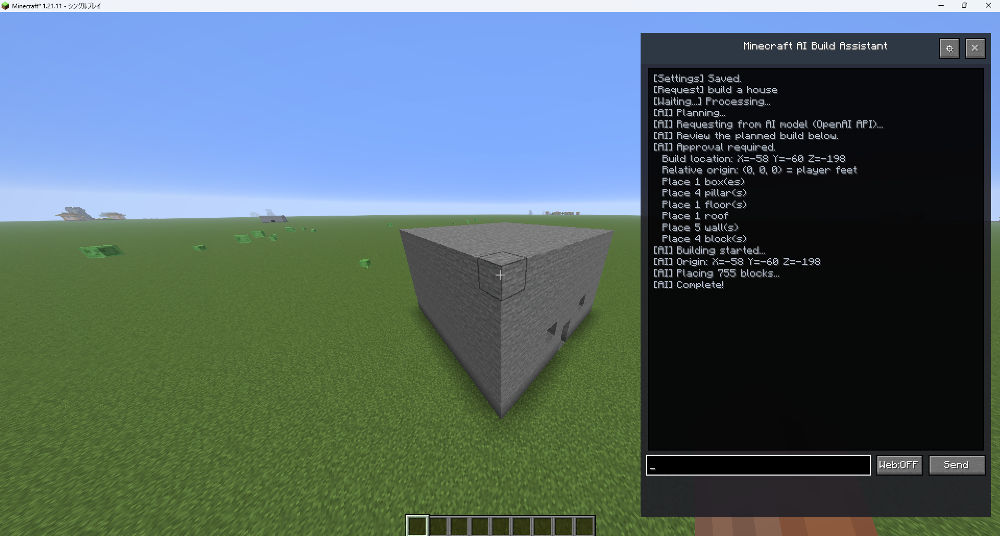

# Minecraft AI Build Assistant

## What is this?

Minecraft AI Build Assistant lets you describe a structure in natural language.

Example:

> Build a medieval watchtower with a stone base and wooden roof.

The AI generates Groovy build code, shows a preview for approval, and then constructs it in the world.

Supports:
- Ollama
- OpenAI
- Custom HTTP AI providers

## Screenshots



Screenshot files live in [`docs/screenshots/`](docs/screenshots/). For the best GitHub preview, upload `showcase.png` first.
Hide chat, player names, coordinates, and API keys before capturing.

## Why is this different?

Unlike command-based builders, this mod:

- Uses natural language prompts
- Supports multiple AI providers
- Requires explicit approval before execution
- Runs inside a Groovy sandbox
- Allows terrain-aware building

## Requirements

| Component | Version |
|-----------|---------|
| Minecraft | 1.21.11 |
| Fabric Loader | 0.19.2+ |
| Fabric API | 0.141.4+1.21.11 |
| Java | 21+ |

## Installation

1. Install [Fabric](https://fabricmc.net/use/) for Minecraft 1.21.11
2. Place Fabric API in your `mods` folder
3. Place the mod JAR in your `mods` folder  
   - Release: `minecraft-ai-build-assistant-<version>.jar`
   - Local build: `build/libs/minecraft-ai-build-assistant-<version>.jar`

**Important:** Use the main JAR only. Do **not** put `*-sources.jar` in `mods/` (it will crash on startup).

## Usage

### Controls

| Action | Description |
|--------|-------------|
| **O key** | Open the Minecraft AI Build Assistant panel |
| **⚙** | Open settings (provider, model, API, forbidden blocks, etc.) |
| **Send** | Submit a build prompt |
| **Web:ON/OFF** | Toggle OpenAI web search for the current session |
| **Accept / Cancel** | Approve or reject the generated build plan |

### Workflow

1. Open the panel and describe what to build (e.g. `build a large house`)
2. The AI generates Groovy code
3. Review the plan in the log (coordinates, box count, etc.)
4. Click **Accept** to start building (blocks are placed via a queue)

### Commands

```
/aibuild <prompt>
/aibuild --web <prompt>    # Enable web search for this request (OpenAI)
```

## Settings

Settings can be changed in-game and are saved to `config/ai_builder/settings.json`.

Example templates (no secrets) are in [`config-examples/`](config-examples/).

### AI Providers

| Provider | Use case | Default URL |
|----------|----------|-------------|
| **Ollama** | Local LLM | `http://localhost:11434` |
| **OpenAI** | OpenAI API | `https://api.openai.com` |
| **Custom** | Custom HTTP endpoint | User-defined |

### OpenAI Web Search

- Enable via **OpenAI Web Search (default)** in settings or **Web:ON** on the panel
- Uses the **Responses API** with the `web_search` tool
- Supported models include `gpt-4o`, `gpt-4.1`, `gpt-5.x` (`gpt-4-turbo` is not supported)

### Forbidden Blocks

- Manage from **Settings → Forbidden Blocks** (icon picker UI)
- Defaults: `minecraft:bedrock`, `minecraft:barrier`
- Synced to `config/ai_builder/forbidden_blocks.txt`

### Other Options

- **Build Speed**: Ticks per block (placement rate)
- **Debug Log**: Verbose logging (off by default; may print prompts and generated scripts to the log)

### Groovy Sandbox

AI-generated scripts run through three compile-time checks before placement:

1. `ScriptSecurityValidator` — rejects dangerous source patterns before parsing
2. `SafeGroovyShellFactory` — `SecureASTCustomizer` limits imports, receivers, and expressions
3. User approval — nothing is placed until you click **Accept**

This is a strong filter, not a full JVM sandbox. Do not run untrusted AI output on a production server without review.

## Config Files

```
config/ai_builder/
├── settings.json           # Provider, model, API key, etc.
└── forbidden_blocks.txt    # Forbidden block list
```

Copy from `config-examples/` when setting up manually. **Never commit real API keys.**

## Groovy Build API

Generated scripts call methods on the `ai` object. All coordinates are **relative to the player's feet at (0, 0, 0)**.

### Placement

```groovy
ai.placeBlock(x, y, z, 'stone_bricks')
ai.placeBlock('stone_bricks', x, y, z)
ai.placeBox(x, y, z, width, height, length, 'stone_bricks')
ai.placePillar(x, y, z, height, 'oak_log')
ai.placeFloor(x, y, z, width, length, 'oak_planks')
ai.placeRoof(x, y, z, width, length, 'spruce_planks')
ai.placeWall(x, y, z, height, length, 'bricks', 'north')
ai.clearArea(x, y, z, width, length)              // single horizontal layer
ai.clearArea(x, y, z, width, height, length)      // box volume
```

- `width` = X size, `length` = Z size, `height` = Y size

### Terrain Inspection

```groovy
ai.getFacing()
ai.getForwardX(distance)
ai.getForwardZ(distance)
ai.getGroundLevel(x, z)
ai.getBlock(x, y, z)
ai.scanForward(8)
ai.scanArea(x, z, width, length)
```

### Block Catalog

```groovy
ai.searchBlocks('stone')
ai.listBlocks(0, 50)
ai.getBlockListCount()
ai.isBlockAllowed('bedrock')
```

## Project Structure

```
src/main/java/com/example/     # Server / common logic
  ai/                          # AI HTTP, prompts, Groovy execution
  config/                      # Settings and forbidden blocks
  network/                     # Server-client payloads
  command/                     # /aibuild commands
src/client/java/com/example/client/  # UI screens and client networking
src/main/resources/                     # fabric.mod.json, assets, lang
config-examples/                        # Sample config (safe to publish)
```

## Building from Source

```bash
./gradlew build          # Build the JAR
./gradlew runClient      # Run the dev client
```

Output: `build/libs/minecraft-ai-build-assistant-<version>.jar`

### Publishing Checklist

Before uploading to GitHub or sharing a ZIP:

1. **Include only source** — `src/`, `gradle/`, `gradlew*`, `build.gradle`, `settings.gradle`, `gradle.properties`, `LICENSE`, `README.md`, `CHANGELOG.md`, `config-examples/`, `docs/screenshots/showcase.png`, `.gitignore`
2. **Never include** — `run/`, `build/`, `.gradle/`, `_decompiled/`, `_recovered/`, `_tools/`
3. **Never include** — any `settings.json` containing a real API key (use `config-examples/settings.json.example` instead)
4. **Verify** — search the upload for `sk-proj`, `sk-`, machine-specific paths (e.g. `C:\Users\...`), and Minecraft player names in comments or logs
5. **Release JAR only** — attach `build/libs/minecraft-ai-build-assistant-<version>.jar` (not `*-sources.jar`, not the whole project folder)

If an API key was ever saved locally, rotate it in the OpenAI dashboard before publishing.

## License

[CC0 1.0 Universal](LICENSE)

## Notes

- OpenAI requires an API key stored in local settings.
- In multiplayer, settings sync to the server; forbidden blocks are enforced on the server.
- Build quality depends on the model and prompt; complex builds may need iteration.
